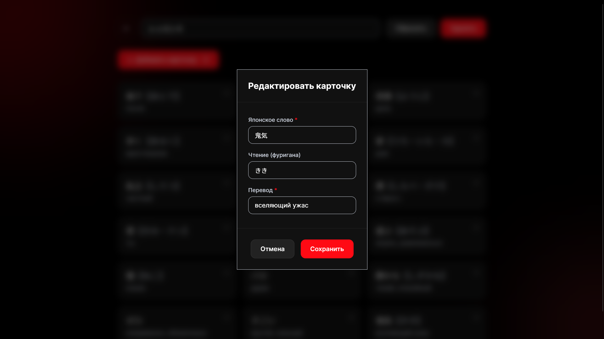
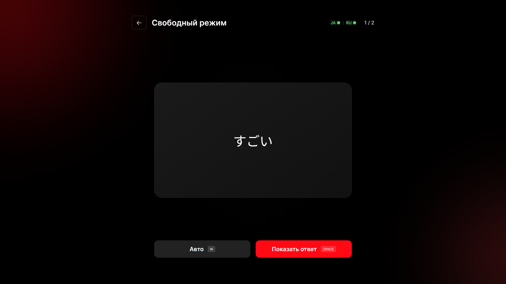
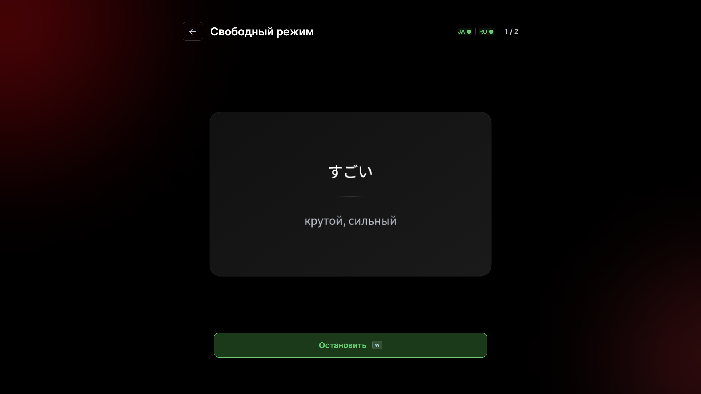
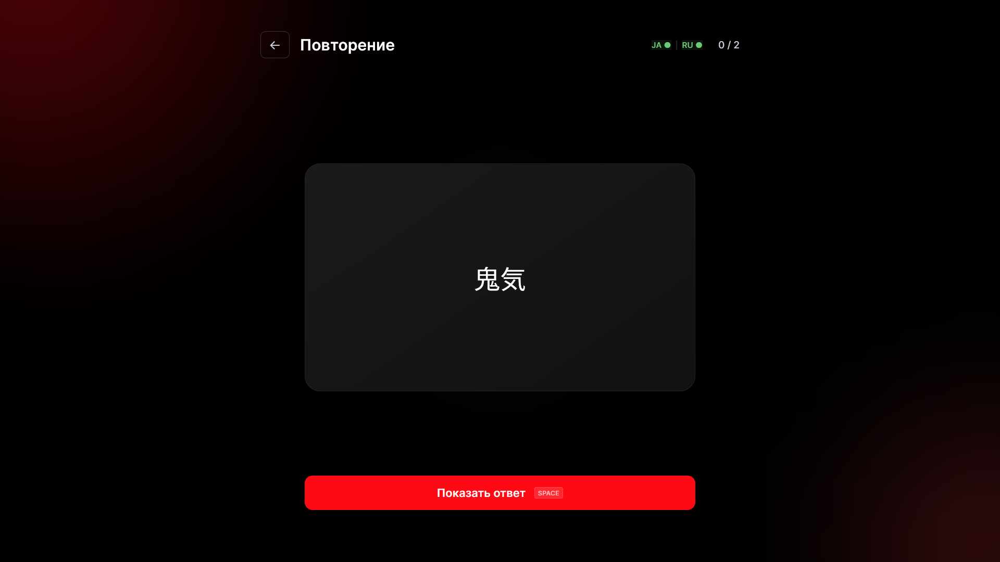
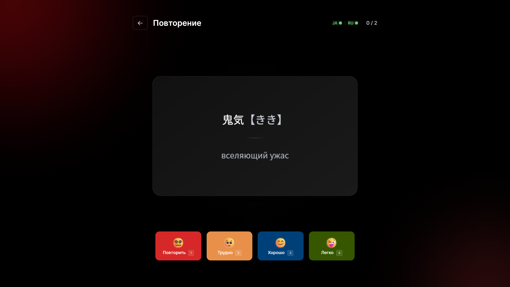
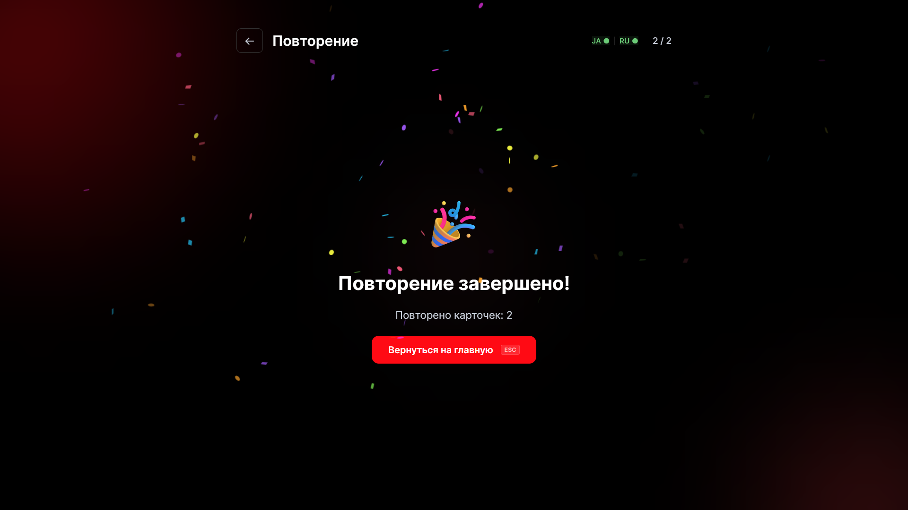

<div align="center">
  
   <h1>Yappari ⛩️</h1>
   <p><b><i>Десктоп-приложение для интервального повторения японских слов ٩(◕‿◕)۶</i></b></p>
   <a href="https://go.dev"></a>
   <a href="https://wails.io"></a>
   <a href="https://vuejs.org"></a>
   <a href="https://www.typescriptlang.org/"></a>
   <a href="https://www.sqlite.org/"></a>
   <br/>
   <a href="https://github.com/MindlessMuse666/yappari/blob/main/LICENSE.md"></a>
   <a href="https://www.microsoft.com/windows"></a>
</div>

---

## Общее описание

**Yappari** (яп. やっぱり — *«как и ожидалось», «всё-таки»*) — это десктопное приложение для изучения японских слов методом интервального повторения. Всё локально, никаких аккаунтов и облаков ✨

Проект родился из желания иметь лёгкое, быстрое и красивое приложение для себя и своих близких, чтобы удобно заучивать японскую лексику.

> **Статус:** Версия v1.2-beta — стабильный релиз, хотя и возможны незначительные баги XD
>
> Есть также **веб-версия** приложения (Go + Vue + TypeScript + CSS): [yappari-web](https://github.com/MindlessMuse666/yappari-web)

---

## Скриншоты

### 🏠 Основной вид

<p align="left">
  
</p>

### 🗂️ Управление колодой

<p align="left">
  
</p>

<details>
<summary>📋 Модальные окна (создание / редактирование / удаление)</summary>

<br/>

| Создание колоды | Создание карточки | Редактирование карточки |
| --- | --- | --- |
|  |  |  |

| Удаление колоды | Удаление карточки | Сброс прогресса |
| --- | --- | --- |
|  |  |  |

</details>

### 🎲 Свободный режим

Листай карточки без расписания — просто для повторения или запоминания.

<p align="left">
  
  &nbsp;&nbsp;
  
</p>

### 🧠 Тренировка (SM-2)

Интервальное повторение с оценкой сложности. Карточки подбираются по расписанию алгоритма SM-2.

<p align="left">
  
  &nbsp;&nbsp;
  
</p>

<p align="left">
  
</p>

---

## Возможности

| Функция | Описание |
| ------- | -------- |
| 🧠 **SM-2** | Алгоритм интервального повторения с ручной оценкой (1-4) |
| 🗂️ **Колоды** | Создавай, редактируй и удаляй тематические наборы карточек |
| 🃏 **Карточки** | Японское слово + чтение каной + русский перевод |
| 🔊 **Озвучка** | Встроенный офлайн TTS: Silero (русский) + Kokoro (японский). Первый запуск — с интернетом, затем полностью офлайн |
| 🎲 **Свободный режим** | Листай карточки без расписания. Есть автовоспроизведение! |
| ⌨️ **Хоткеи** | Полное управление с клавиатуры (см. таблицу ниже) |
| 🌙 **Тёмная тема** | Чёрный фон, белый текст, акцентный красный `#ff0a14`. Анимированные орбы на фоне |
| 🎬 **Анимации** | Плавная смена карточек, flip-эффект, skeleton-загрузка, confetti при завершении |
| 🖥️ **Полный экран** | Переключение по `F` или через профиль-поповер |

### Хоткеи

| Клавиша | Действие | Страница |
| ------- | -------- | -------- |
| `N` | Создать колоду | Главная |
| `A` | Выбрать все / сбросить | Главная |
| `Q` | Новая карточка | Управление колодой |
| `W` | Автовоспроизведение | Тренировка |
| `Space` | Показать ответ | Тренировка |
| `1` `2` `3` `4` | Оценка карточки (SM-2) | Тренировка |
| `Esc` | Назад / Выход | Все страницы |
| `F` | Полный экран / Окно | Все страницы |

---

## Стек технологий

### Backend

- **Go 1.25+** — бизнес-логика, SM-2, IPC с WebView2
- **SQLite** (via `modernc.org/sqlite` — без CGO!)
- **Silero TTS** (русский) + **Kokoro TTS** (японский) — встроенные офлайн-модели синтеза речи через управляемый Python-подпроцесс

### Frontend

- **Vue.js 3** + **TypeScript**
- **PrimeVue 4** (Dialog, Button, Input, ProgressBar)
- **Inter** + **Noto Sans JP** (локальные шрифты)
- **canvas-confetti** для анимации

### Desktop

- **Wails v2** (Go + WebView2)

---

## Быстрый старт

### Требования

- Windows 10/11 (с WebView2 Runtime)
- Go 1.25+
- Node.js 18+
- Python 3.9+ (для встроенного TTS — устанавливается автоматически при первом запуске)

> **Озвучка:** При первом запуске приложение создаёт Python-окружение и скачивает модели Silero (русский, ~30MB) и Kokoro (японский, ~300-500MB). Требуется интернет. Последующие запуски — полностью офлайн. Процесс автоматический — не требует ручной установки.

### Шаги запуска

```bash
# 1. Склонируй репозиторий
git clone https://github.com/MindlessMuse666/yappari.git
cd yappari

# 2. Установи зависимости фронтенда
cd frontend
npm install
cd ..

# 3. (Опционально) Установи TTS-окружение
make install-tts
#    или вручную:
#    python backend/tts/python/setup_tts.py

# 4. Запусти в режиме разработки
wails dev
```

### Сборка

```bash
wails build -clean -platform windows/amd64
```

Готовый `.exe` появится в папке `build/bin/`.

---

## Разработка

### Структура проекта

```text
yappari/
├── main.go              # точка входа Wails
├── app.go               # IPC-методы
├── backend/
│   ├── database/        # SQLite: модели, CRUD, миграции
│   ├── sm2/             # алгоритм SM-2
│   └── tts/             # Python-подпроцесс Silero + Kokoro TTS
│       └── python/      # tts_server.py, silero_handler.py, kokoro_handler.py
├── frontend/            # Vue.js приложение
│   ├── src/
│   │   ├── views/       # Home, DeckManage, Training
│   │   ├── components/  # KanaText, CustomAlert, TtsStatus
│   │   ├── composables/ # IPC-вызовы + моки
│   │   └── router/      # Vue Router
│   └── public/fonts/    # Inter + Noto Sans JP
└── docs/                # документация
```

### Команды

| Команда | Описание |
| ------- | -------- |
| `wails dev` | Запуск в режиме разработки (hot-reload) |
| `wails build` | Продакшн-сборка |
| `go test ./...` | Запуск тестов Go |
| `ruff check backend/tts/python/` | Линтинг Python-кода |
| `golangci-lint run ./...` | Линтинг Go-кода |

---

## Веб-версия

Существует также **веб-версия** Yappari: [yappari-web](https://github.com/MindlessMuse666/yappari-web).

---

## Лицензия

Проект распространяется под лицензией [GNU AGPL v3](LICENSE.md).

---

<div align="center">
  
  <br>
  <sub><b>Yappari // Интервальное повторение японских слов</b></sub>
  <br>
  <sup><i>made with ❤️ by <a href="https://github.com/MindlessMuse666" target="_blank">MindlessMuse666</a></i></sup>
</div>
