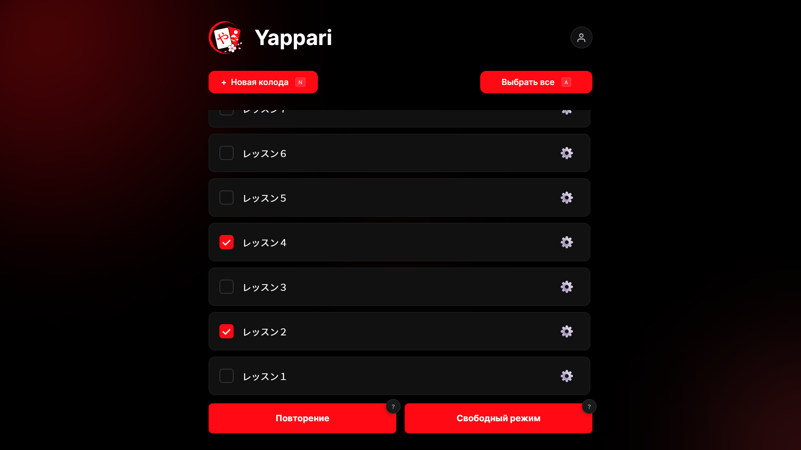
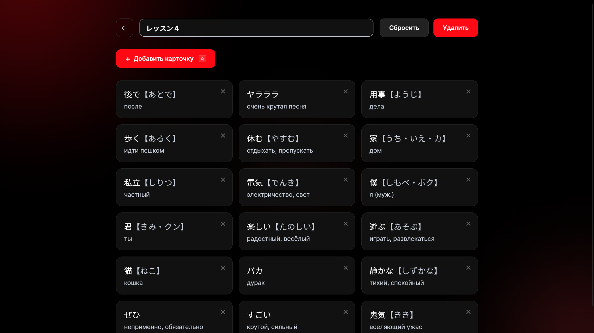
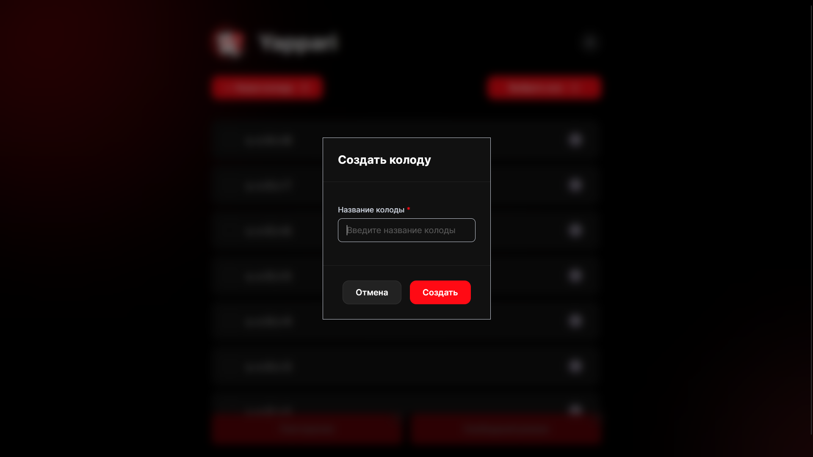
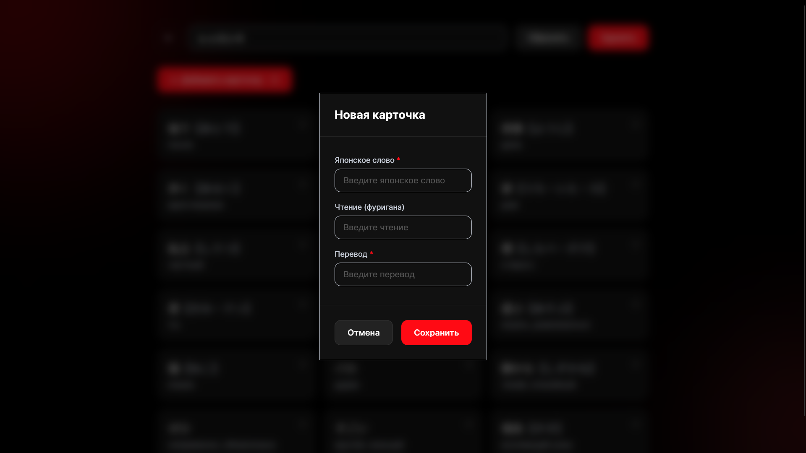
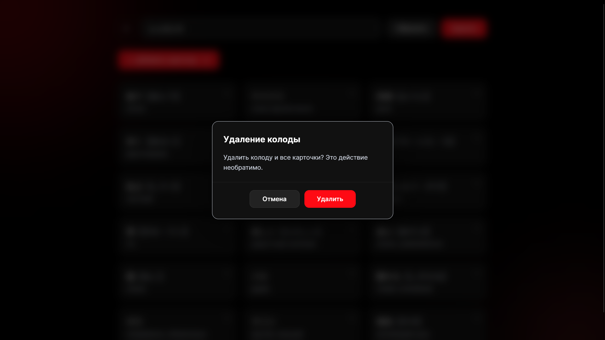
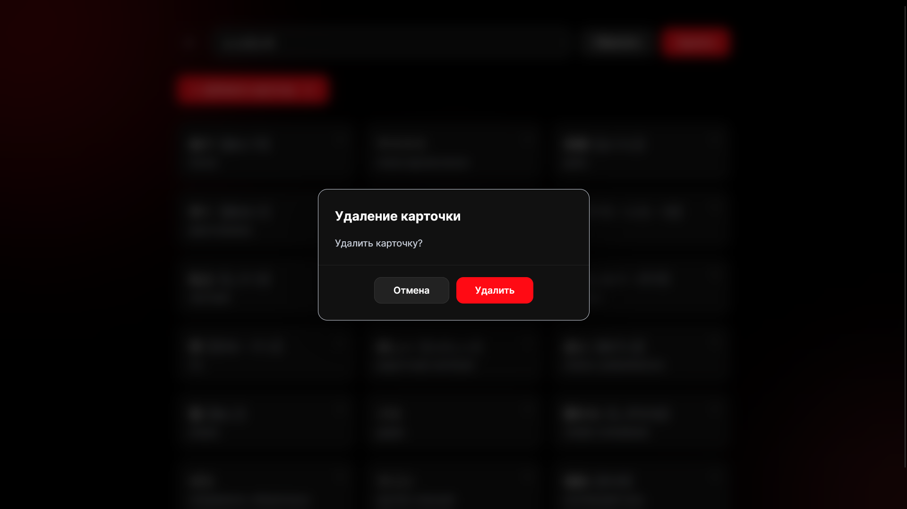
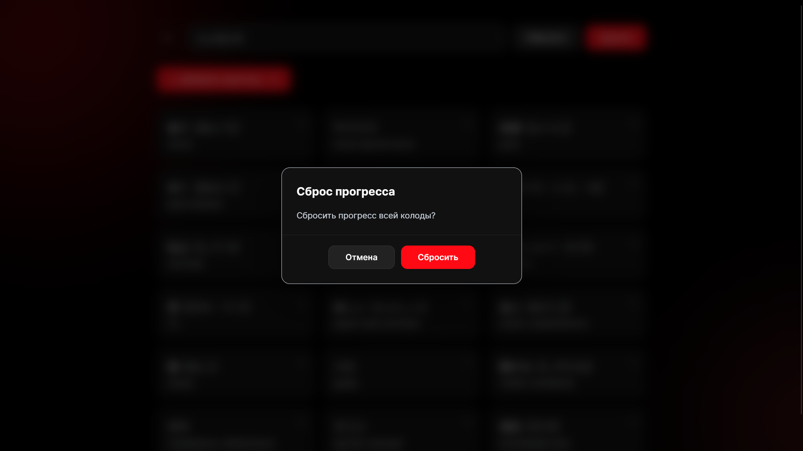

<div align="center">
  
   <h1>Yappari ⛩️</h1>
   <p><b><i>Десктоп-приложение для интервального повторения японских слов ٩(◕‿◕)۶</i></b></p>
   <a href="https://go.dev"></a>
   <a href="https://wails.io"></a>
   <a href="https://vuejs.org"></a>
   <a href="https://www.typescriptlang.org/"></a>
   <a href="https://www.sqlite.org/"></a>
   <a href="https://github.com/MindlessMuse666/yappari/blob/main/LICENSE.md"></a>
   <a href="https://www.microsoft.com/windows"></a>
</div>

---

## Общее описание

**Yappari** (яп. やっぱり — *«как и ожидалось», «всё-таки»*) — это десктопное приложение для изучения японских слов методом интервального повторения. Всё локально, никаких аккаунтов и облаков ✨

Проект родился из желания иметь лёгкое, быстрое и красивое приложение для себя и своих близких, чтобы удобно заучивать японскую лексику.

> **Статус:** Версия v1.0 — стабильный релиз 🚀

<details open>
   <summary><b>Нажмите, чтобы скрыть/показать скриншоты</b></summary>
   <table>
     <tr>
       <td align="center"><br><sub><i>Рис 1. Главная страница: выбор колод и режима</i></sub></td>
       <td align="center"><br><sub><i>Рис 2. Управление колодой: просмотр и редактирование</i></sub></td>
     </tr>
     <tr>
       <td align="center"><br><sub><i>Рис 3. Интервальное повторение: оценка карточки</i></sub></td>
       <td align="center"><br><sub><i>Рис 4. Свободный режим: автовоспроизведение</i></sub></td>
     </tr>
     <tr>
       <td colspan="2" align="center">
         <b>Модальные окна:</b><br><br>
         
         
         
         
         
         <br><sub><i>Рис 5. Модальные окна: создание, удаление, сброс</i></sub>
       </td>
     </tr>
   </table>
</details>

---

## Возможности

| Функция | Описание |
| ------- | -------- |
| 🧠 **SM-2** | Классический алгоритм интервального повторения с ручной оценкой |
| 🗂️ **Колоды** | Создавай, редактируй и удаляй тематические наборы карточек |
| 🃏 **Карточки** | Японское слово + чтение каной + русский перевод |
| 🔊 **Озвучка** | Три уровня fallback: edge-tts (Python) -> Windows TTS (System.Speech) -> резервный Web Speech API |
| 🔄 **3D Flip** | Карточка переворачивается с анимацией — сперва слово, потом ответ |
| 🎲 **Свободный режим** | Листай карточки без расписания. Есть автовоспроизведение! |
| 🎉 **Конфетти** | Праздничная анимация после каждой завершённой тренировки |
| 🌙 **Тёмная тема** | Чёрный фон, белый текст, акцентный красный `#ff0a14` |

---

## Стек технологий

### Backend

- **Go 1.25+** — бизнес-логика, SM-2, IPC с WebView2
- **SQLite** (via `modernc.org/sqlite` — без CGO!)
- **edge-tts** / **Windows TTS** — синтез речи (MP3 через Python edge-tts или WAV через System.Speech)

### Frontend

- **Vue.js 3** + **TypeScript**
- **PrimeVue 4** (Dialog, Button, Input, ProgressBar)
- **Inter** + **Noto Sans JP** (локальные шрифты)
- **canvas-confetti** для анимации

### Desktop

- **Wails v2** (Go + WebView2)

---

## Быстрый старт

### Требования

- Windows 10/11 (с WebView2 Runtime)
- Go 1.25+
- Node.js 18+
- Python 3.x + `edge-tts` (опционально — для наилучшего качества озвучки)

> **Озвучка без Python:** Если edge-tts не установлен, приложение автоматически использует встроенный Windows TTS (System.Speech). Для японского и русского языков потребуется установить соответствующий языковой пакет в настройках Windows.

### Шаги запуска

```bash
# 1. Склонируй репозиторий
git clone https://github.com/MindlessMuse666/yappari.git
cd yappari

# 2. Установи зависимости фронтенда
cd frontend
npm install
cd ..

# 3. (Опционально) Установи edge-tts для лучшей озвучки
pip install edge-tts

# 4. Запусти в режиме разработки
wails dev
```

### Сборка

```bash
wails build -clean -platform windows/amd64
```

Готовый `.exe` появится в папке `build/bin/`.

---

## Разработка

### Структура проекта

```text
yappari/
├── main.go              # точка входа Wails
├── app.go               # IPC-методы
├── backend/
│   ├── database/        # SQLite: модели, CRUD, миграции
│   ├── sm2/             # алгоритм SM-2
│   └── tts/             # edge-tts + Windows TTS обёртка
├── frontend/            # Vue.js приложение
│   ├── src/
│   │   ├── views/       # Home, DeckManage, Training
│   │   ├── components/  # FuriganaText, CustomAlert
│   │   ├── composables/ # IPC-вызовы + моки
│   │   └── router/      # Vue Router
│   └── public/fonts/    # Inter + Noto Sans JP
└── docs/                # документация
```

### Команды

| Команда | Описание |
| ------- | -------- |
| `wails dev` | Запуск в режиме разработки (hot-reload) |
| `wails build` | Продакшн-сборка |
| `go test ./...` | Запуск тестов |

---

## Лицензия

Проект распространяется под лицензией [GNU AGPL v3](LICENSE.md).

---

<div align="center">
  
  <br>
  <sub><b>Yappari // Интервальное повторение японских слов</b></sub>
  <br>
  <sup><i>made with ❤️ by <a href="https://github.com/MindlessMuse666" target="_blank">MindlessMuse666</a></i></sup>
</div>
